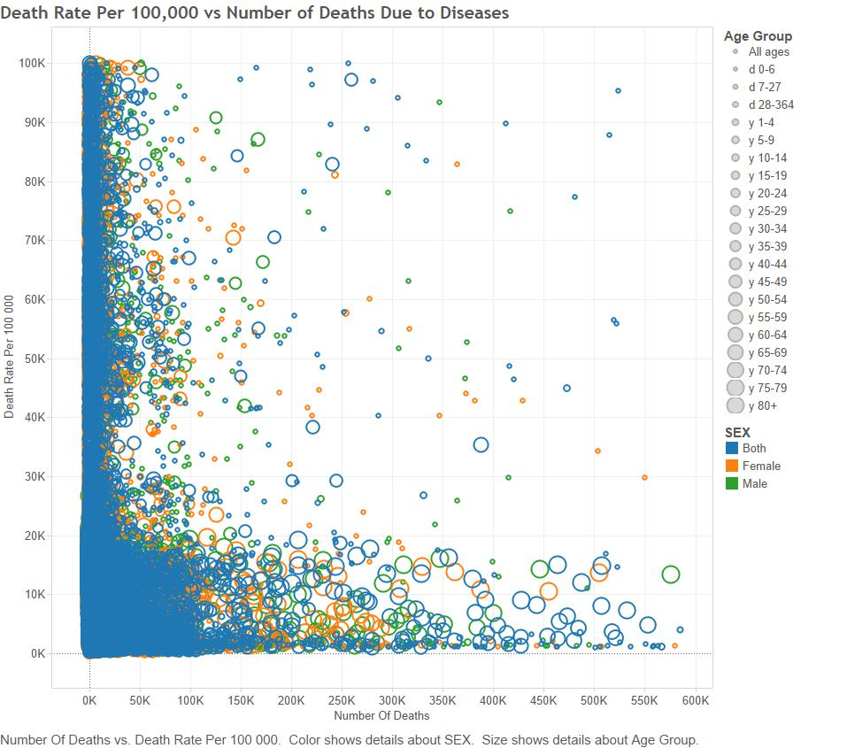
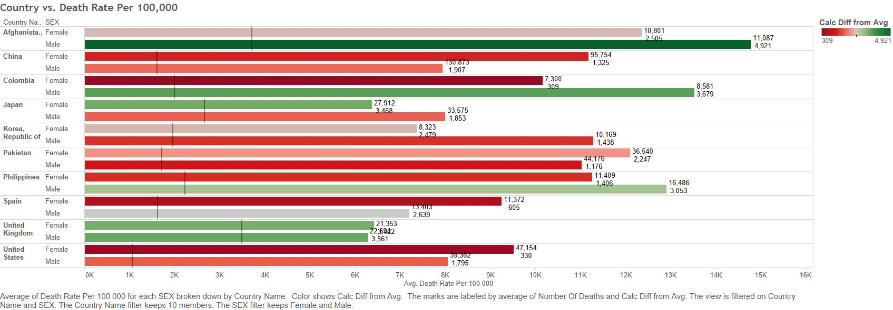

#### Steps used to create this project
#####1. Using GitHub, create a Repo
#####2. Clone the Repository into the Data Visualization Folder (Or the folder you wish)
#####3. Create R Studio Folders for all the project development (folder descriptions below)
#####4. Use KnitR to to build an HTML to reproduce the project
#####4. Find some CSVs that can be blended and/or joined to show interesting data trends
#####5. Modify the R_ETL.R given and run the code to get the code to develop a SQL table
#####6. Using Oracle SQL Developer, paste the code output from the R_ETL.R script to create a table
#####7. After the table is created, import the data from the CSV reformattted file to the table
#####9. Using R and SQL, recreate the three required visualization plots that were made in tableau
#####10. Modify the R_ETL.R given and run the code to get the code to develop a SQL table
#####11. Using Oracle SQL Developer, paste the code output from the R_ETL.R script to create a table
#####12. After the table is created, import the data from the CSV reformattted file to the table
#####13. Use R/SQL, Shiny and tableau to demonstrate our knowledge of the 5 different kinds of tables in Cannata's methodology presentation. 


#### Folders Needed
#####00 Doc: Holds the .Rmd and .html files containing these instructions and project output and also holds RPROFILE to load all required packages. Also contains the .pngs of the tableau visualizations for the .Rmd.
#####01 Data: Generates the ETL code to create the table in Oracle. Gathers the data from the database for and puts it into data frames.
#####03. Tableau Workbooks: Contains the .twbx file that has the tableau workbook
#####04 Shiny: Contains the server.R and ui.R files for the shiny application. Also has our www subfolder that holds a bootsrap.css file that create the style of our app.

#### Data Description
##### Our data looks at the way disease affects different countries accross the world. The two main variables are the number of deaths due to disease and the death rate per 100,000. The latter is a standard way of normalizing the number of deaths to be able to accurately compare and scale the effect disease has on each country despite size differences. This data is an accumulation of data from 1975-2010. We compare the countries' death and disease rates to GDP to see if there is a relationship.

###Project WebApp Link
[Shiny Data Visualizations](https://nathanriojas.shinyapps.io/DVFinal)


#Tableau Visuals


##Scatter Plot 
###(start with 2 green things) -also demonstrates Maps, Actions, Dashboards, and the Analytics Tab - Models and Forecasting


##Barchart 
###(start with a blue thing and a green thing) - also demonstrate Table Calculations, the Analytics Tab - Reference Lines, ID Sets, and Formatting
###Compares the countries with their death rates per 100,000 separated by sex



##Crosstabs 
###(start with two blue things and a green thing) - also demonstrates Key Performance Indicators (KPIs), Calculated Fields, Sets, Parameters, and Hierarchies
###Shows the number of deaths, death rate and calculated death rate for different age groups and countries


##Data Blending
###joining data together


##Aggregated Measures Analysis 
###(start with a green thing) - also demonstrates Histograms, Dual-axis Plots and Show Me
####each color represents an age group (youngest in the center) and the size represents the number of people that died proportionally to the others


##Map
###(start with a green thing [measure] and a blue thing [dimension] under show me click filled maps)
###There is a page setup for year that does decades 1970-2010


##Non-Aggregated Measures Analysis 
###(start with a green thing) - also demonstrates Boxplots, Dates, and Pages
###BoxPlot
###Distribution of the data through the different quartile ranges, separated by sex


#### The following code is the code from the files in our project
###ETL code 

```
#setwd("C:/Users/Nathan R/Documents/DataVisualization/Project 4/01 Data/CSVs")

#file_path <- "Effect of Disease Country Pop.csv"

#df <- read.csv(file_path, stringsAsFactors = FALSE)

##Replace "." (i.e., period) with "_" in the column names.
#names(df) <- gsub("\\.+", "_", names(df))

#str(df) # Uncomment this and  run just the lines to here to get column types to use for getting the list of measures.

#measures <- c("Year","Number of Deaths", "Death Rate Per 100,000")
##measures <- NA # Do this if there are no measures.

##Get rid of special characters in each column.
##Google ASCII Table to understand the following:
#for(n in names(df)) {
#  df[n] <- data.frame(lapply(df[n], gsub, pattern="[^ -~]",replacement= ""))
#}

#dimensions <- setdiff(names(df), measures)
#if( length(measures) > 1 || ! is.na(dimensions)) {
#  for(d in dimensions) {
#    # Get rid of " and ' in dimensions.
#    df[d] <- data.frame(lapply(df[d], gsub, pattern="[\"']",replacement= ""))
#    # Change & to and in dimensions.
#    df[d] <- data.frame(lapply(df[d], gsub, pattern="&",replacement= " and "))
#    # Change : to ; in dimensions.
#    df[d] <- data.frame(lapply(df[d], gsub, pattern=":",replacement= ";"))
#  }
#}

#library(lubridate)
##Fix date columns, this needs to be done by hand because | needs to be correct.
##                                                      \_/


##The following is an example of dealing with special cases like making state abbreviations be all upper case.
##df["State"] <- data.frame(lapply(df["State"], toupper))

##Get rid of all characters in measures except for numbers, the - sign, and period.dimensions
#if( length(measures) > 1 || ! is.na(measures)) {
#  for(m in measures) {
#    df[m] <- data.frame(lapply(df[m], gsub, pattern="[^--.0-9]",replacement= ""))
#  }
#}

#write.csv(df, paste(gsub(".csv", "", file_path), ".reformatted.csv", sep=""), row.names=FALSE, na = "")

#tableName <- gsub(" +", "_", gsub("[^A-z, 0-9, ]", "", gsub(".csv", "", file_path)))
#sql <- paste("CREATE TABLE", tableName, "(\n-- Change table_name to the table name you want.\n")
#if( length(measures) > 1 || ! is.na(dimensions)) {
#  for(d in dimensions) {
#    sql <- paste(sql, paste(d, "varchar2(4000),\n"))
#  }
#}
#if( length(measures) > 1 || ! is.na(measures)) {
#  for(m in measures) {
#    if(m != tail(measures, n=1)) sql <- paste(sql, paste(m, "number(38,4),\n"))
#    else sql <- paste(sql, paste(m, "number(38,4)\n"))
#  }
#}
#sql <- paste(sql, ");")
#cat(sql)

```


```
#require(tidyr)
#require(dplyr)
#require(ggplot2)

#setwd("C:/Users/Nathan R/Documents/DataVisualization/Project 4/01 Data/CSVs")

#file_path <- "Country GDP.csv"

#df <- read.csv(file_path, stringsAsFactors = FALSE)

## Replace "." (i.e., period) with "_" in the column names.
#names(df) <- gsub("\\.+", "_", names(df))

## str(df) # Uncomment this and  run just the lines to here to get column types to use for getting the list of measures.

#measures <- c("2005", "2006", "2007", "2008", "2009", "2010" , "2011", "2012", "2013", "2014", "2015", "2016", "2017", #"2018", "2019", "2020")
##measures <- NA # Do this if there are no measures.

## Get rid of special characters in each column.
## Google ASCII Table to understand the following:
#for(n in names(df)) {
#  df[n] <- data.frame(lapply(df[n], gsub, pattern="[^ -~]",replacement= ""))
#}

#dimensions <- setdiff(names(df), measures)
#if( length(measures) > 1 || ! is.na(dimensions)) {
#  for(d in dimensions) {
#    # Get rid of " and ' in dimensions.
#    df[d] <- data.frame(lapply(df[d], gsub, pattern="[\"']",replacement= ""))
#    # Change & to and in dimensions.
#    df[d] <- data.frame(lapply(df[d], gsub, pattern="&",replacement= " and "))
#    # Change : to ; in dimensions.
#    df[d] <- data.frame(lapply(df[d], gsub, pattern=":",replacement= ";"))
#  }
#}

#library(lubridate)
## Fix date columns, this needs to be done by hand because | needs to be correct.
##                                                        \_/
#df$Order_Date <- gsub(" [0-9]+:.*", "", gsub(" UTC", "", mdy(as.character(df$Order_Date), tz="UTC")))
#df$Ship_Date  <- gsub(" [0-9]+:.*", "", gsub(" UTC", "", mdy(as.character(df$Ship_Date),  tz="UTC")))

## The following is an example of dealing with special cases like making state abbreviations be all upper case.
## df["State"] <- data.frame(lapply(df["State"], toupper))

## Get rid of all characters in measures except for numbers, the - sign, and period.dimensions
#if( length(measures) > 1 || ! is.na(measures)) {
#  for(m in measures) {
#    df[m] <- data.frame(lapply(df[m], gsub, pattern="[^--.0-9]",replacement= ""))
#  }
#}

#write.csv(df, paste(gsub(".csv", "", file_path), ".reformatted.csv", sep=""), row.names=FALSE, na = "")

#tableName <- gsub(" +", "_", gsub("[^A-z, 0-9, ]", "", gsub(".csv", "", file_path)))
#sql <- paste("CREATE TABLE", tableName, "(\n-- Change table_name to the table name you want.\n")
#if( length(measures) > 1 || ! is.na(dimensions)) {
#  for(d in dimensions) {
#    sql <- paste(sql, paste(d, "varchar2(4000),\n"))
#  }
#}
#if( length(measures) > 1 || ! is.na(measures)) {
#  for(m in measures) {
#    if(m != tail(measures, n=1)) sql <- paste(sql, paste(m, "number(38,4),\n"))
#    else sql <- paste(sql, paste(m, "number(38,4)\n"))
#  }
#}
#sql <- paste(sql, ");")
#cat(sql)
```

```
setwd("C:/Users/Nathan R/Documents/DataVisualization/Final Project/01 Data")

file_path <- "Fortune 500 Companies.csv"

df <- read.csv(file_path, stringsAsFactors = FALSE)

#Replace "." (i.e., period) with "_" in the column names.
names(df) <- gsub("\\.+", "_", names(df))

#str(df) # Uncomment this and  run just the lines to here to get column types to use for getting the list of measures.

measures <- c("Year", "Rank")
#measures <- NA # Do this if there are no measures.

#Get rid of special characters in each column.
#Google ASCII Table to understand the following:
for(n in names(df)) {
  df[n] <- data.frame(lapply(df[n], gsub, pattern="[^ -~]",replacement= ""))
}

dimensions <- setdiff(names(df), measures)
if( length(measures) > 1 || ! is.na(dimensions)) {
  for(d in dimensions) {
    # Get rid of " and ' in dimensions.
    df[d] <- data.frame(lapply(df[d], gsub, pattern="[\"']",replacement= ""))
    # Change & to and in dimensions.
    df[d] <- data.frame(lapply(df[d], gsub, pattern="&",replacement= " and "))
    # Change : to ; in dimensions.
    df[d] <- data.frame(lapply(df[d], gsub, pattern=":",replacement= ";"))
  }
}

library(lubridate)
#Fix date columns, this needs to be done by hand because | needs to be correct.
#                                                      \_/


#The following is an example of dealing with special cases like making state abbreviations be all upper case.
df["State"] <- data.frame(lapply(df["State"], toupper))

#Get rid of all characters in measures except for numbers, the - sign, and period.dimensions
if( length(measures) > 1 || ! is.na(measures)) {
  for(m in measures) {
    df[m] <- data.frame(lapply(df[m], gsub, pattern="[^--.0-9]",replacement= ""))
  }
}

write.csv(df, paste(gsub(".csv", "", file_path), ".reformatted.csv", sep=""), row.names=FALSE, na = "")

tableName <- gsub(" +", "_", gsub("[^A-z, 0-9, ]", "", gsub(".csv", "", file_path)))
sql <- paste("CREATE TABLE", tableName, "(\n-- Change table_name to the table name you want.\n")
if( length(measures) > 1 || ! is.na(dimensions)) {
  for(d in dimensions) {
    sql <- paste(sql, paste(d, "varchar2(4000),\n"))
  }
}
if( length(measures) > 1 || ! is.na(measures)) {
  for(m in measures) {
    if(m != tail(measures, n=1)) sql <- paste(sql, paste(m, "number(38,4),\n"))
    else sql <- paste(sql, paste(m, "number(38,4)\n"))
  }
}
sql <- paste(sql, ");")
cat(sql)

```


```{r warning = FALSE}
source("../00 Doc/Rprofile.R", echo = TRUE)
source("../01 Data/Dataframes.R", echo = TRUE)
```{r}
